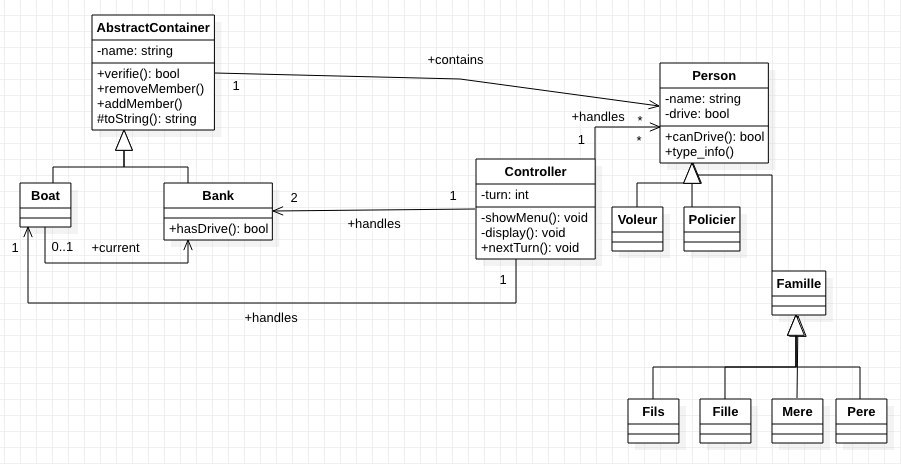

# Rapport laboratoire 4 

## but du laboratoire

Il nous a été demandé dans ce laboratoire d'implémenter un petit programme en ligne de commande permettant de jouer au célèbre casse tête de la rivière.

## diagramme UML 

## choix implémentation

### gestion des règles 

lors de l'action d'un utilisateur les containeurs se voient modifier, comme il y a des modifications que l'utilisateur n'a pas le droit de faire nous avons choisi de ne pas tester si le changement été possible puis d'effectuer le changement mais plutôt d'effectuer le changement, puis de vérifier que les règles soient toujours respecter et si ce n'est pas le cas renversé le changement. 

Dans notre configuration la class Controller à la responsabilité d'effectuer le changement puis appelle la méthode verifie() pour chacun des containers ayant subi une modification et reverse le choix si cette fonction retourne false. 

Nous avons choisi cette implémentation car elle permet facilement de rajouter des réglés (typiquement pour le bateau qui doit en plus des régles standards vérifier s'il n'y a pas plus de deux personnes) dans les sous class de AbstractContainer.

### déplacement du bateau 

Nous avons ajouter un attribut booléan dans la class controlleur qui nous permet de savoir si le bateau se trouve sur la rive gauche ou droite. Lorsque le joueur veut déplacer le bateau la class controleur appelle la méthode hasdrive de Boat qui vérifie si il y a une personne pouvant conduire à bords, si c'est le cas le booléan est inversée. 

### Choix des class et sous class Person

Pour représenter les différents types de personne nous avions le choix entre faire un enum représentant le type de la personne (policier, voleur , fils,...) ou bien de définir une class pour chaque type de personne. Nous avons choisi le deuxième choix car cella nous permettrais de redéfinir un nouveau type facilement, de plus si on voudrais faire des comportements différents comme retenir pour un fils ses parents (ce qui n'a pas été nécessaire dans cette version) il serait plus facile de le réaliser. 

Pour pouvoir récupérer en dehors des class Person le type de cette dernière nous avons choisi d'implémenter une fonction virtuel type_info dans Person qui doit être override dans chacune des sous class de personne. Cette fonction retourne le nom de la class sous forme de string à l'aide de la méthode typeid().name. Ainsi grâce au transcryptage dynamique nous pouvons retourner le bon type de personne même si nous appelons cette méthode depuis le point de vue d'une personne.

 ### instanciation des personnes 

nous avons choisi d'instancier les personnes directement dans le main car nous désirons que notre class Controller puisse être initialisé avec plusieurs configuration de personne possible. le main construit donc le Controller avec une list de personne et lance le première tour, lorsqu'un tour se fini un nouveau tour est lancé jusqu'à ce que l'utilisateur appuis sur q.

### test effectuer 

* nous avons tester toutes les erreurs possibles:
  * Il ne peut y avoir que deux personnes au maximum sur le bateau.
  * Les enfants et le voleur ne peuvent piloter le bateau (mais peuvent y monter lorsqu’il est à quai).
  * Le voleur ne peut pas rester en contact avec un membre de la famille si le policier n'est pas présent.
  * Les fils ne peuvent rester seuls avec leur mère si le père n’est pas présent.
  * Les filles ne peuvent rester seules avec leur père si la mère n’est pas présente.
* Nous avons aussi tester avec des mauvais inputs ce qui nous a permis d'effectuer une petite correction (dans la première version cessi fessait crash le programme)

## amélioration possible

nous ne testons pas les conditions de victoire, le joueur peut donc se trouver frustré de ne pas avoir d'écran de fin de partie lorsqu'il gagne. 

Notre implémentions pour retournée le type de personne n'est pas la plus optimal ou propre, d'autre implémentation aurait pu être possible car il y a moyen en c++ de connaître le type de la class la plus basse sans passé par ce type d'implémentation. 

